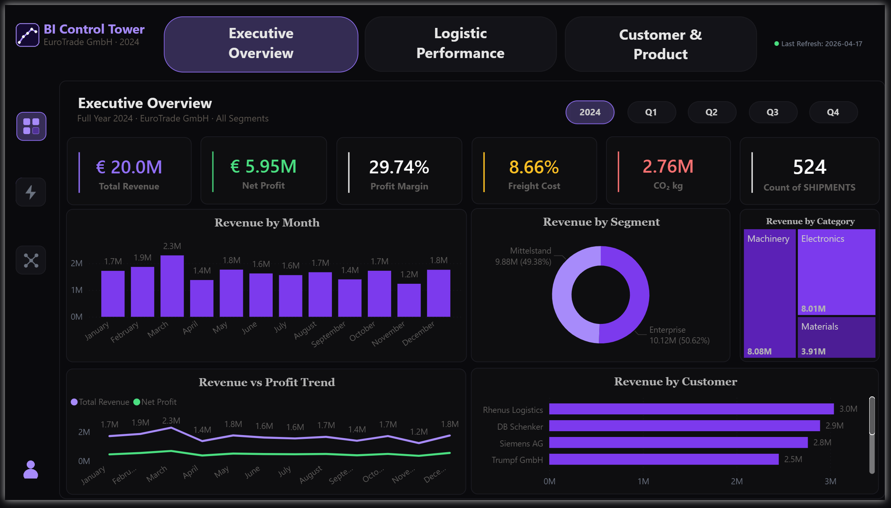
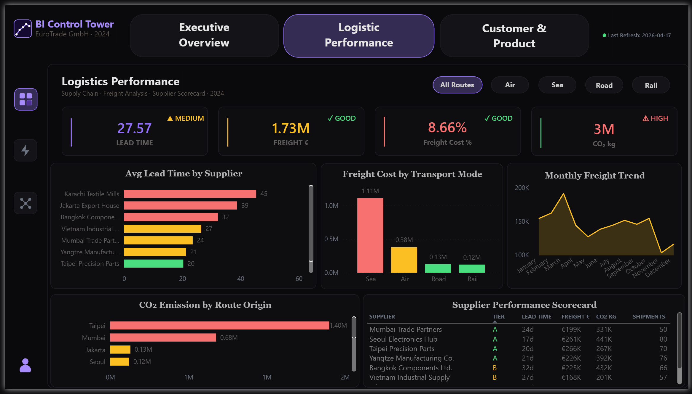
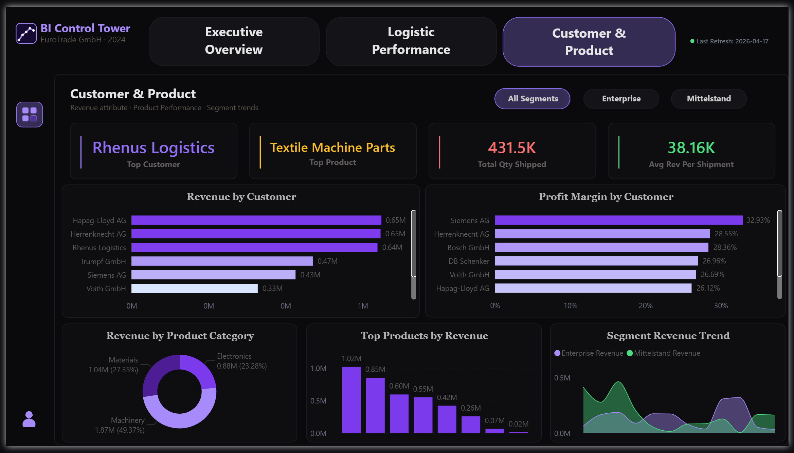

<div align="center">


<br/><br/>


<br/>

[](https://github.com/AIAnalysticsKureshi)
[](https://www.linkedin.com/in/mohammad-kureshi/)
[](https://github.com/AIAnalyticsKureshi)

</div>

---

## 📸 Dashboard Preview

### Page 1 — Executive Overview


### Page 2 — Logistics Performance


### Page 3 — Customer & Product Analysis


---

## 🎯 The Business Problem

EuroTrade GmbH — a fictional European logistics operator — had shipment data scattered across systems with no single source of truth. Leadership had zero visibility into delivery performance, route profitability, supplier reliability, or CO₂ compliance under CSRD regulations.

This project delivers the **complete BI layer** to fix that. Not a tutorial. Not a course exercise. A full end-to-end system built from scratch to mirror real enterprise BI work — covering data warehouse design, ETL engineering, data quality assurance, and executive-grade Power BI reporting.

---

## 🏗️ Architecture

```
Raw Business Data
      │
      ▼
┌─────────────────────────────┐
│   ETL Pipeline              │
│   Python · Pandas           │
│   524 records · 100% clean  │
└─────────────┬───────────────┘
              │
              ▼
┌─────────────────────────────┐
│   SQLite Data Warehouse     │
│   Star Schema               │
│   6 Tables · 524 Rows       │
└─────────────┬───────────────┘
              │
              ▼
┌─────────────────────────────┐
│   Power BI Dashboard        │
│   3 Pages · DAX Measures    │
│   Bookmark Navigation       │
│   Obsidian Violet Theme     │
└─────────────────────────────┘
```

---

## 📊 Key Business Metrics

| Icon | Metric | Value | Status |
|------|--------|-------|--------|
| 📦 | Total Shipments | 524 | ✅ Full year 2024 |
| 💶 | Total Revenue | €20.0M | ✅ Verified |
| 📈 | Net Profit | €5.95M | ✅ 29.74% margin |
| 🚛 | Freight Cost % | 8.66% | ⚠️ Near 9% threshold |
| ⏱️ | Avg Lead Time | 27.6 days | ⚠️ Road worst at 30.1d |
| 🌿 | Total CO₂ | 2.76M kg | ✅ CSRD tracked |
| ✈️ | Air vs Sea CO₂ Ratio | 10.96× | ❌ Air dominant |
| 🌱 | CO₂ Saving Potential | 68.2% | ✅ Modal shift identified |
| ⭐ | Best Mode | Rail | ✅ 7.81% cost · 24.7d · lowest CO₂ |
| 🔴 | Worst Mode | Air | ❌ 9.99% cost · 75% of total CO₂ |

---

## 🗄️ Data Model — Star Schema

```
                    ┌─────────────┐
                    │  DIM_DATE   │
                    │  date_key   │
                    │  month_name │
                    │  quarter    │
                    └──────┬──────┘
                           │
┌─────────────┐    ┌───────┴────────┐    ┌──────────────────┐
│ DIM_PRODUCT │    │ FACT_SHIPMENTS │    │   DIM_SUPPLIER   │
│ product_key ├────┤ 524 rows       ├────┤  tier            │
│ category    │    │ revenue_eur    │    │  avg_lead_time   │
│ sub_category│    │ freight_cost   │    │  defect_rate_pct │
└─────────────┘    │ lead_time_days │    └──────────────────┘
                   │ co2_kg_emitted │
┌─────────────┐    └───────┬────────┘    ┌──────────────────┐
│DIM_CUSTOMER │            └─────────────┤   DIM_ROUTE      │
│ segment     │                          │  transport_mode  │
│ company_name│                          │  distance_km     │
│ city/country│                          │  emission_factor │
└─────────────┘                          │  co2_tier        │
                                         └──────────────────┘
```

---

## ✅ Completed Deliverables

| Week | Layer | Deliverable | Status |
|------|-------|-------------|--------|
| 1 | 🗄️ SQL | Star schema design · 6 tables · Window functions · RANK() · CTEs · CO₂ tracking queries | ✅ Complete |
| 2 | 🐍 Python | ETL pipeline · Automated data quality scorecard · 5 validation checks · 100% quality score | ✅ Complete |
| 3 | 📊 Power BI | 3-page dashboard · 20+ DAX measures · Bookmark navigation · Obsidian Violet theme · Interactive sidebar views | ✅ Complete |

---

## 🖥️ Power BI Dashboard — 3 Pages

The dashboard is delivered as a single `.pbix` file using **bookmark-based navigation** — a persistent top navbar controls page-level navigation, and a left sidebar manages sub-views within each page. Visual theme: **Obsidian Violet**.

---

### ⚡ Page 1 — Executive Overview

**Main View:** 6 KPI cards covering revenue, net profit, profit margin, freight cost %, total CO₂, and shipment count. Revenue by month trend line · Customer segment donut · Profit trend.

**Sidebar View — Operational Efficiency:**
Freight cost % by transport mode · Lead time by mode · CO₂ emissions donut · Mode scatter plot · 3 dynamic alert indicators (Red / Amber / Green) for Freight, Lead Time, and CO₂.

**Sidebar View — Supplier & Route Intelligence:**
Supplier scorecard with Gold/Silver/Bronze tier classification · Revenue by country · Lead time by supplier tier · Distance vs. freight cost scatter.

---

### 🚚 Page 2 — Logistics Performance

Route-level freight cost analysis · Delivery lead time breakdown by transport mode · CO₂ emissions by mode with Air vs. Sea comparison · Modal shift saving potential (68.2%) · Supplier reliability scorecard.

---

### 👥 Page 3 — Customer & Product Analysis

Revenue and profitability by customer segment · Product category performance · Top customer accounts · Segment margin comparison.

---

## 🧮 DAX Measures

```dax
-- Core Financial
Freight Cost Pct     = DIVIDE(SUM(freight_cost_eur), SUM(revenue_eur))
Net Profit           = SUM(revenue_eur) - SUM(cogs_eur) - SUM(freight_cost_eur)
Profit Margin %      = DIVIDE([Net Profit], SUM(revenue_eur))

-- Operational
Avg Lead Time        = AVERAGE(lead_time_days)
Rail CO2             = CALCULATE(SUM(co2_kg_emitted), transport_mode = "Rail")
Air CO2              = CALCULATE(SUM(co2_kg_emitted), transport_mode = "Air")
CO2 Saving Potential = DIVIDE([Air CO2] - [Rail CO2], [Air CO2])

-- Display Formatting
Lead Time Display    = FORMAT(AVERAGE(lead_time_days), "0.0") & " days"
Rail CO2 Display     = FORMAT([Rail CO2], "#,##0") & " kg"
Last Refresh         = "Last Refresh: " & FORMAT(NOW(), "YYYY-MM-DD")

-- Dynamic Alert Text
Freight Trend Text   = "Air highest at " & FORMAT([AirFreightPct]*100,"0.00") & "%"
Lead Time Trend Text = "Road worst at " & FORMAT([RoadLeadTime],"0.0") & " days"
Air vs Sea Ratio     = FORMAT(DIVIDE([Air CO2],[Sea CO2]),"0.00") & "× vs Sea"

-- Alert Status  (0 = Green · 1 = Amber · 2 = Red)
Freight Alert Status = IF([Freight Cost Pct] > 0.09, 2, IF([Freight Cost Pct] > 0.08, 1, 0))
Lead Time Alert      = IF([Avg Lead Time] > 29, 2, IF([Avg Lead Time] > 27, 1, 0))
CO2 Alert            = IF([Air CO2] > 2000000, 2, IF([Air CO2] > 1500000, 1, 0))
```

---

## 🔍 Key Business Findings

> ✈️ **Finding 1 — Air Transport is the primary cost and emissions risk**
> Air freight costs 9.99% of revenue — the highest of all modes — and accounts for 75% of total CO₂ at 2.08M kg. At 10.96× the CO₂ per shipment of sea freight, shifting non-urgent volume from Air to alternative modes is the single highest-impact action available to leadership.

> ⭐ **Finding 2 — Rail is the strategic optimum**
> Rail delivers the lowest freight cost (7.81%), shortest lead time (24.7 days), and the lowest CO₂ footprint of all modes. Increasing Rail's modal share directly improves margin, delivery performance, and CSRD compliance simultaneously.

> ⏱️ **Finding 3 — Road has the worst delivery performance**
> Average lead time on Road is 30.1 days — the highest across all transport modes. Specific routes consistently breach the 32-day threshold and require operational review.

> 💰 **Finding 4 — Margin is healthy but under measurable pressure**
> A 29.74% net profit margin is strong. However, freight cost at 8.66% is approaching the 9% internal threshold. Air transport is the primary driver — reducing air usage directly protects margin without any change to pricing or volume.

> 🌱 **Finding 5 — 68.2% CO₂ reduction achievable through modal shift**
> Modelling a full transition of Air shipments to Sea or Rail routes yields a 68.2% reduction in total CO₂ emissions, positioning EuroTrade for CSRD compliance well ahead of regulatory deadlines.

---

## 📁 Repository Structure

```
BI-Control-Tower-EuroTrade/
│
├── 📁 01_SQL/
│   ├── create_schema.sql
│   ├── logistics_warehouse.db
│   └── queries/
│       ├── 01_revenue_analysis.sql
│       ├── 02_supplier_scorecard.sql
│       ├── 03_window_functions.sql
│       ├── 04_cte_analysis.sql
│       └── 05_co2_tracking.sql
│
├── 📁 02_Python/
│   ├── etl_pipeline.py
│   └── data_quality_scorecard.py
│
├── 📁 03_PowerBI/
│   └── BI-Control-Tower-EuroTrade-GmbH.pbix
│
└── README.md
```

---

## 🛠️ Tech Stack

<div align="center">


</div>

---

## 👤 About the Author

Built by **Mohammad M. Kureshi** — Business Intelligence Analyst based in Berlin, Germany. Actively seeking BI Analyst, Reporting Analyst, and Data Analyst roles across Germany.

Every layer of this project — from schema design to ETL pipeline to Power BI dashboard — was independently designed and delivered from scratch as proof of full-stack BI capability.

<div align="center">

[](https://www.linkedin.com/in/mohammad-kureshi/)
[](https://github.com/AIAnalyticsKureshi)
[](mailto:mohd.kureshi04@gmail.com)

</div>

---

<div align="center">
<sub>📍 Berlin, Germany · Open to relocation · 🏆 Microsoft PL-300 In Progress · May 2026 · 🗓️ Last updated: April 2026</sub>
</div>
